# Références de direction artistique

**Aucune DA finale approuvée.** Simon : « pas totalement satisfait mais ça donne une idée ».

Les huit premières images sont ses préférées. La sélection claire porte explicitement sur les portraits. A–D sont les derniers essais, pas une décision. Images générées pendant la discussion; maquettes de recherche, pas captures du moteur. Copies JPEG pour garder le dépôt léger; aucun changement de composition.

## Lecture de la sélection

- Urbain sombre, gritty, quotidien; références d’ambiance Watchmen, Batman, Kick-Ass.
- Portraits expressifs, reconnaissables en petit, encrés ou semi-réalistes. Ne pas masquer tous les visages.
- Carte nocturne lisible et réalisable sur navigateur/mobile; éviter de produire des milliers de détails décoratifs.
- Interface structurée, contrastes francs; jaune sale ou orange sont des pistes, pas une palette validée.
- Le prototype utilise une carte géométrique originale et un atlas de trois portraits. Il ne reproduit pas une maquette pixel à pixel.

## Planches

### Minuit jaune sale — sélection utilisateur

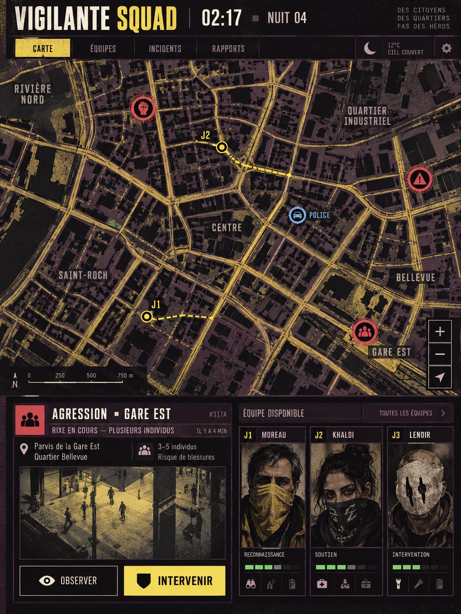

Source de génération : `exec-564dd274-f6c7-4c7c-a14f-fcd780b01127.png`.

### Noir sous la pluie — sélection utilisateur

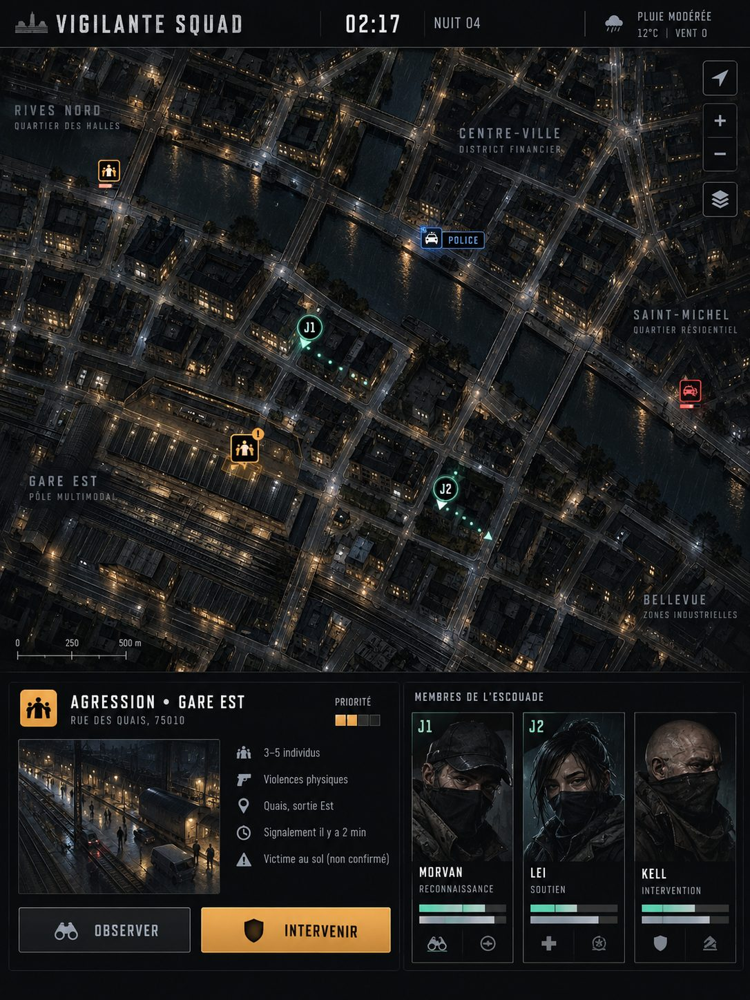

Source de génération : `exec-316687d0-7986-4e68-87ba-978baef27a9f.png`.

### Cartographie nocturne — sélection utilisateur

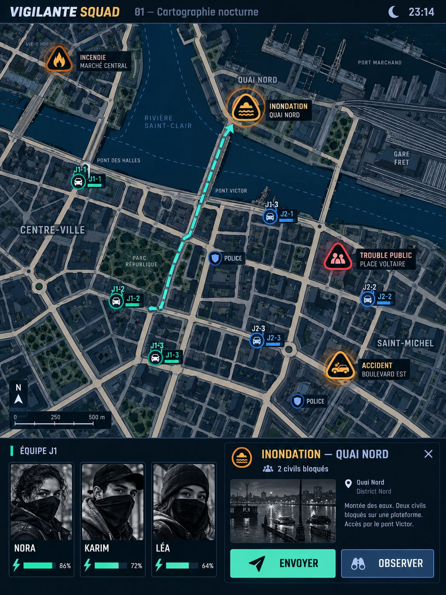

Source de génération : `exec-ab2c9b8a-7ecb-4c18-be8d-1be5dbaa8f22.png`.

### Comics sous contrôle — sélection utilisateur

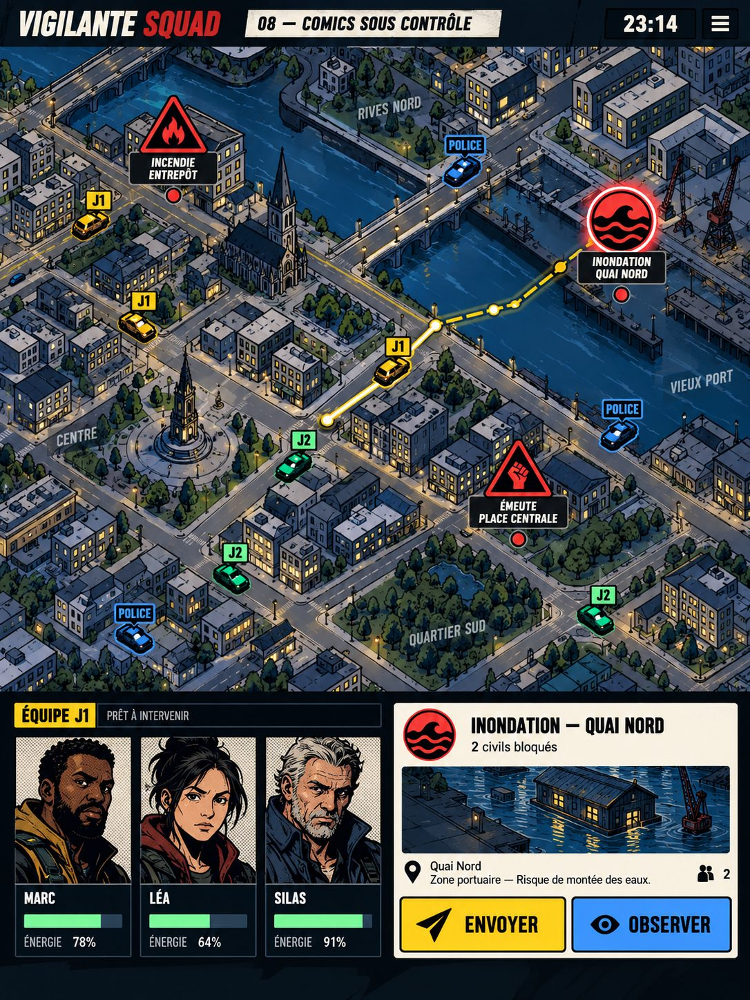

Source de génération : `exec-b3b685a7-9bc1-4bf4-9bbf-a6d3eb787100.png`.

### Brutalisme clandestin — sélection utilisateur

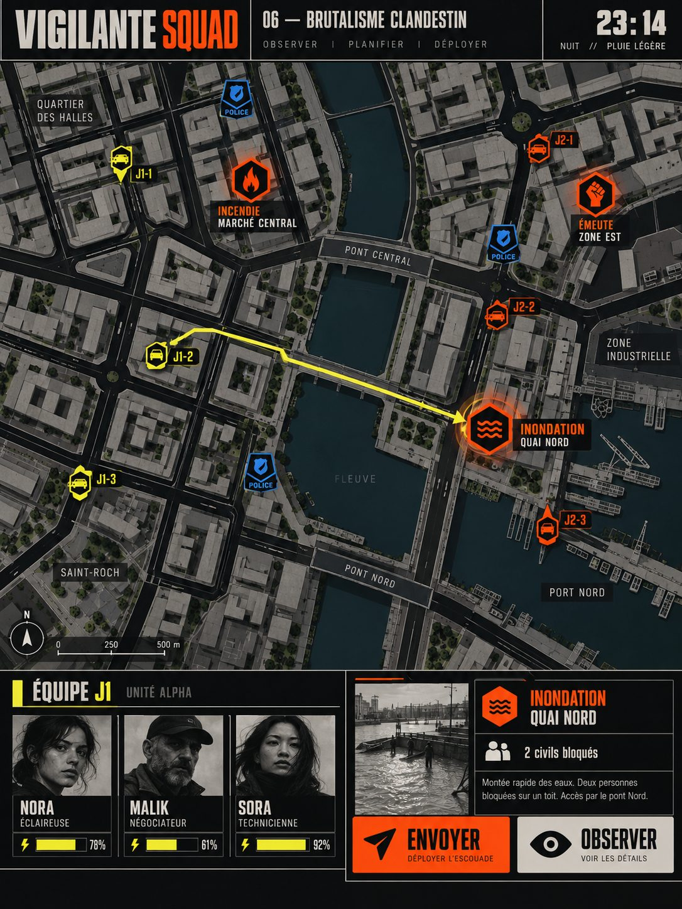

Source de génération : `exec-8bbdf171-bebf-481e-b430-74036f68aa02.png`.

### Terminal 1998 — sélection utilisateur

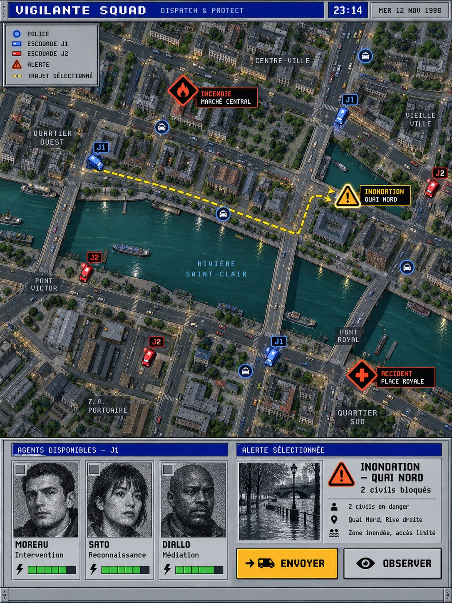

Source de génération : `exec-1ce361f0-a5b0-4a6e-aebf-b9782cf82e1c.png`.

### Ville miniature — sélection POUR LES PORTRAITS, pas la carte claire

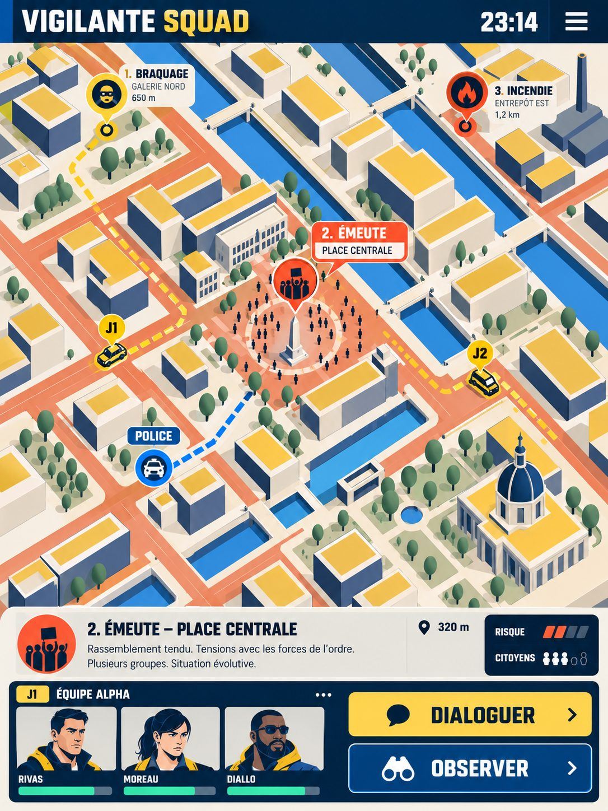

Source de génération : `exec-982ef5d4-2f6d-4a9d-b4c0-56b47842addb.png`.

### Surveillance en mosaïque — sélection utilisateur

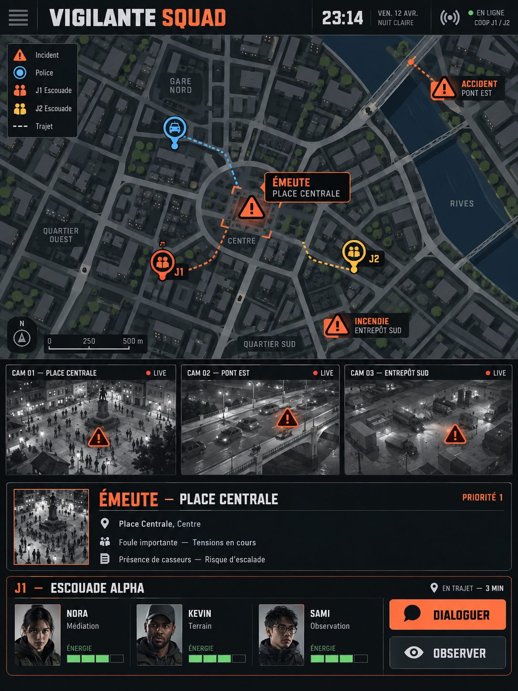

Source de génération : `exec-40c86a07-f629-42c6-9242-6ae2041c9028.png`.

### Proposition A — non approuvée

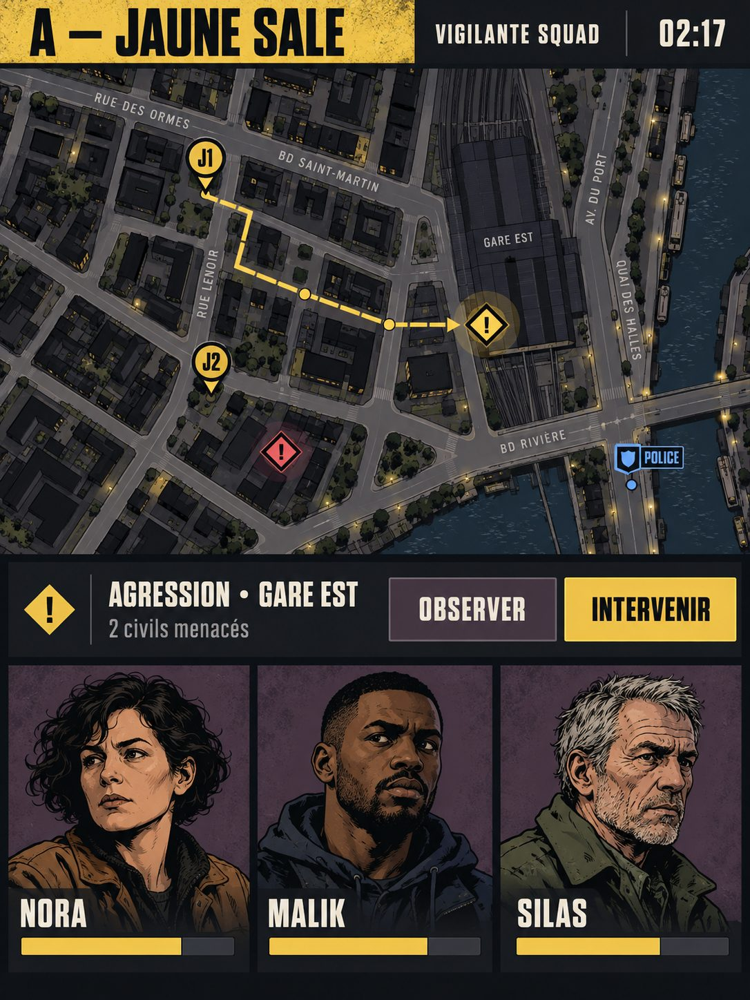

Source de génération : `exec-f095f185-bb7b-4d3f-b686-ad7bcef8a32b.png`.

### Proposition B — non approuvée

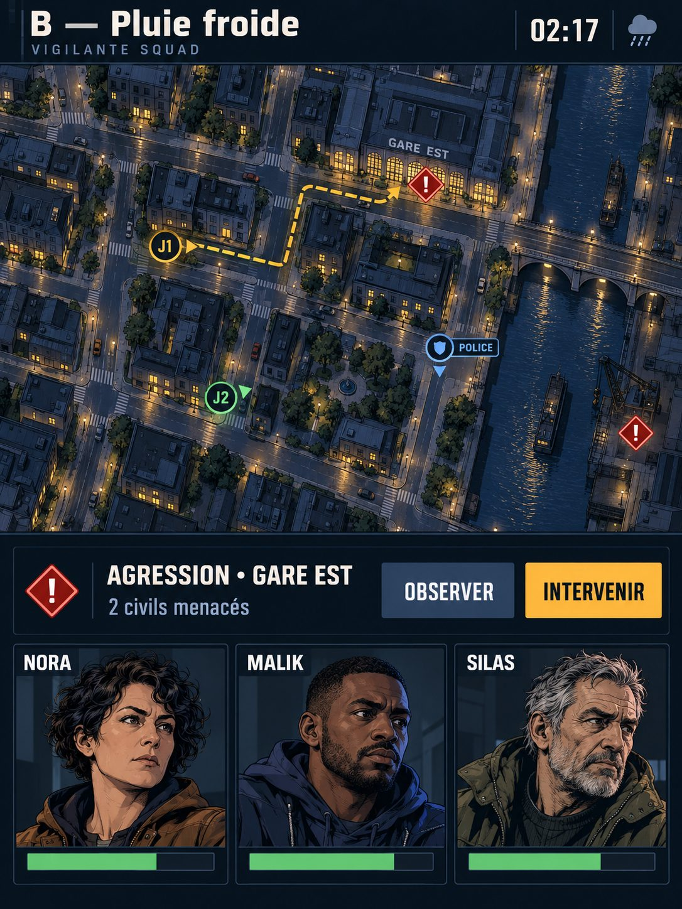

Source de génération : `exec-b7071808-1495-488e-a8d4-ef5417b02907.png`.

### Proposition C — non approuvée

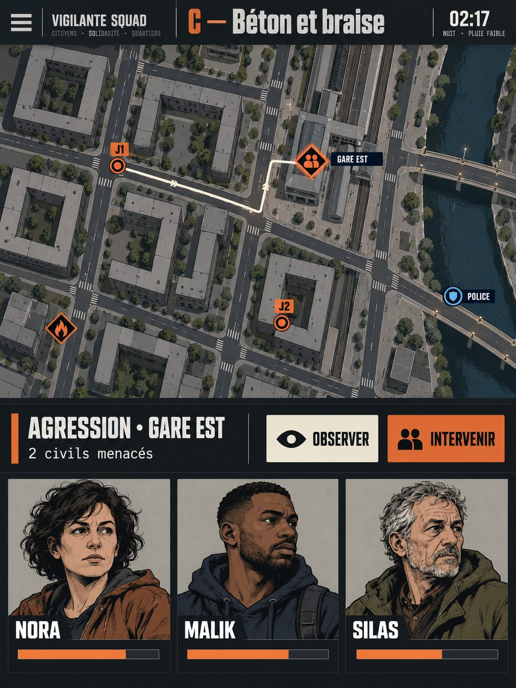

Source de génération : `exec-040076ea-6d37-4dfe-af38-82378f64008a.png`.

### Proposition D — non approuvée

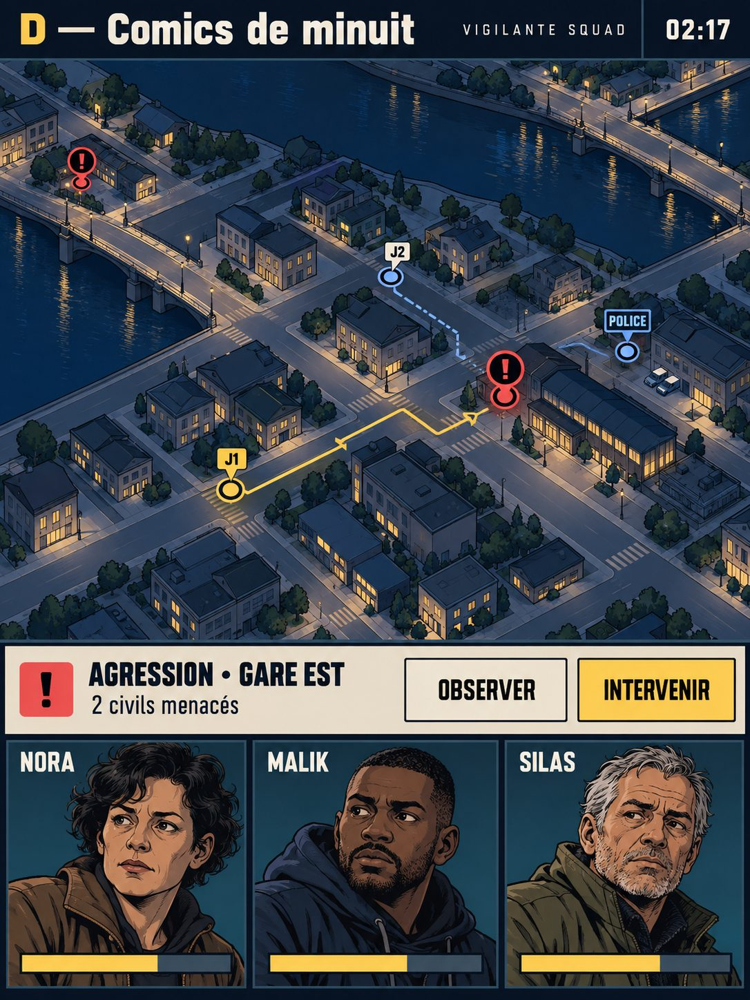

Source de génération : `exec-dd09e0ff-8553-4539-9120-91edc5fc7052.png`.
